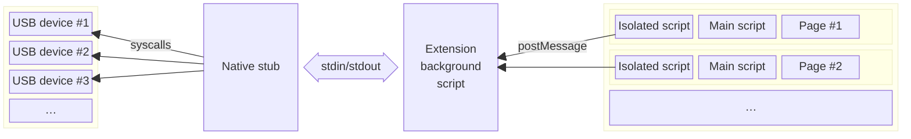

# High-level overview

Data flows through this extension as follows:

Each instance of the web browser (of which most users are usually only running one) hosts a _single_ instance of the extension "[background script](https://developer.mozilla.org/en-US/docs/Mozilla/Add-ons/WebExtensions/Background_scripts)", which talks to _one_ instance of the native stub binary. This communication is done by exchanging JSON messages over [standard streams](https://en.wikipedia.org/wiki/Standard_streams) (stdin/stdout).

The (single) native stub can communicate with any number of USB devices, and it does this using APIs specific to each operating system.

Each web page that the user visits gets two "[content scripts](https://developer.mozilla.org/en-US/docs/Mozilla/Add-ons/WebExtensions/Content_scripts)" injected into it. These scripts can interact with and modify the web page. In this case, "modify" means "makes WebUSB APIs exist".

One of these content scripts runs in the "`ISOLATED`" world while the other runs in the "`MAIN`" world. The "`MAIN`" world script is responsible for creating all of the [types](https://wicg.github.io/webusb/#usbdevice-interface) etc. accessible to the web page. The "`MAIN`" world script sends data back and forth to the "`ISOLATED`" world script using function calls. The "`ISOLATED`" world script packages this up into [messages](https://developer.mozilla.org/en-US/docs/Web/API/Window/postMessage) to communicate with the background script.

The main factor driving this design was the desire to be able to provide notifications according to [WebUSB descriptors](https://wicg.github.io/webusb/#webusb-descriptors). This is used by hardware devices to suggest a web page that a user can visit in order to interact with the device. In order to make this work, something needs to be watching for USB devices even when no web page is trying to use USB. Once there existed _a_ background service, it felt easiest to route _all_ requests through that single service.

This was reinforced by the fact that each extension can only have a single background page. (Firefox doesn't support background service workers. Multiple script _files_ are possible, but they run in the same background context.) It didn't feel very useful to "fan out" requests to multiple processes when requests always get serialized while passing through the background page.

## Where state is kept

This extension is architected around WebExtensions Manifest V2 with a persistent background script. This means that both the background script and the native stub are "long-lived" and are expected to stick around the entire time the browser is open.

As a result, I have chosen that:

- the native stub keeps around (in its memory) information about all USB devices on the system. This information includes things such as the vendor/product IDs and handles for accessing the device via the operating system.
- the background script also keeps around information about all USB devices on the system. It also keeps all the information about user consent and permissions granted to each page.
- the "isolated" content script keeps almost no information. It is mostly responsible for exchanging messages with the "main" content script.
- the "main" content script keeps information only about devices that the page has specifically been granted access to.

Some consequences of these architectural choices:

- the native stub does not know anything about web pages at all. Although it happens to implement the VID/PID blocklist, it is primarily focused on dealing with operating system APIs. It does not handle any WebUSB-specific security concerns. This is okay because it isn't able to do anything beyond what "any other random program" on the computer could also do.
- the extension background script is important for security. It is responsible for making sure web pages cannot access anything the user has not granted permissions for.
- because there is _one_ extension background script and _one_ native stub serving _multiple_ pages, the background script also needs to track the number of pages that have a device open and which (if any) pages have "claimed" an interface for exclusive access.
- redundant information is stored in multiple places. Because so many of the relevant APIs are built around message passing (and not state sharing), there exists a high probability that state can get out of sync due to programming mistakes. There is currently no architectural mitigations for this other than "being careful" (which is not really a mitigation).

# Design of the native stub

The native stub is written in Rust. However, due to the heavy reliance on operating-system APIs, the code makes extensive use of `unsafe` throughout. Although some effort has been made to "be very careful" and not have UB or other errors, the code has prioritized using Rust's library ecosystem, build tooling, and the "even unsafe Rust can make a better C" philosophy rather than prioritizing a "Rust-native" design or correctness in all cases.

This code is very "opinionated" and has intentionally avoided using FFI interfaces to existing C code as well as the currently-existing Rust USB libraries, due to prioritizing the following goals:

- async throughout, but _not Rust async_
- giving explicit manual control over "event loop" handling
- single-threaded as much as possible (not possible on Windows)
- no messing about with C toolchains while building

During the early brainstorming phase, this project was initially planned to make use of Rust async. Unfortunately, I found that I wasn't able to easily figure out how to integrate "weird" functionality such as udev events or IOKit notification ports into the popular Rust async runtimes. This then led me down a path to studying in detail how Rust async executors are implemented, which then led to a realization that Rust's support for _multithreaded_ async [significantly increases complexity](https://maciej.codes/2022-06-09-local-async.html). I then went down a path of looking into "fine, I'll do it myself".

While investigating how to do it all myself, I was also studying OS APIs for USB, and I realized that _completion events_ map _very_ directly to a message-passing interface (such as the stdio-based one we are required to use). It thus made sense to build around a design where the stub does not keep track of in-flight transfers (only the operating system kernel and the JavaScript code do). The stub turns request messages into syscalls and completion notifications into response messages, completely handing off ownership of all the relevant data to the OS while the transfer is in progress.

This design means that there was _no reason_ to use async in the Rust code. The _other end_ of the connection, JavaScript, is _also_ capable of async, and its async is arguably much more ergonomic to use.

All of this prerequisite studying (at this point primarily focused on macOS and Linux APIs) gave me enough understanding of how completions work on these platforms that I decided I might as well control the program's entire run loop, and I might as well explicitly not use threading. This was inspired by traditional \*nix-and-C style daemon designs.

So, in practice:

## macOS

macOS uses the `kqueue` syscall in the runloop to wait for events. `stdin` is added to the kqueue in order to handle requests from the browser. Every other notification which comes from IOKit is in fact delivered over a [Mach port](https://docs.darlinghq.org/internals/macos-specifics/mach-ports.html), which can also be added to the kqueue.

This functionality _is_ documented, just not well. The USB interfaces in `IOUSBLib` in particular explicitly support doing this. The key function which bridges the "Mach world" and the "IOKit world" is `IODispatchCalloutFromMessage`.

## Linux

Linux uses the `epoll` family of syscalls to wait for events. `stdin` is added in order to handle requests from the browser. udev device notifications are delivered over a [netlink socket](https://man7.org/linux/man-pages/man7/netlink.7.html), which, because it is a socket, can obviously be added to epoll as well.

Although the [official documentation](https://docs.kernel.org/driver-api/usb/usb.html#asynchronous-i-o-support) for Linux only mentions getting completion notifications using [signals](https://man7.org/linux/man-pages/man7/signal.7.html), it is and has always been [in fact possible to use `poll`/`epoll`](https://github.com/torvalds/linux/blob/bf4afc53b77aeaa48b5409da5c8da6bb4eff7f43/drivers/usb/core/devio.c#L2839-L2844). Note that the semantics are a bit fuzzy, since completions are indicated with `EPOLLOUT` even though `write` is never used.

## Windows

Windows is the anomaly in that it is very eager to spawn threads in ways that you cannot fully control. Windows also does not have a single universal IO multiplexer that works in all cases.

The Windows implementation uses [CM_Register_Notification](https://learn.microsoft.com/en-us/windows/win32/api/cfgmgr32/nf-cfgmgr32-cm_register_notification) (part of the CfgMgr32 APIs) in order to detect device hotplug events. The mechanism this uses under the hood is [undocumented](https://docs.rs/wnf/latest/wnf/), but it invokes callbacks on the [default thread pool](https://learn.microsoft.com/en-us/windows/win32/procthread/thread-pools). Since there is no way to change this, we take advantage of this and perform _blocking_ query operations in the callback to fetch and pre-cache all the USB descriptors we might need. Once we are fully done poking and prodding at the newly-discovered device, we use a [`mpsc::channel`](https://doc.rust-lang.org/beta/std/sync/mpsc/fn.channel.html) to send the _data_ to the main thread. In order to _notify_ the main thread in a multiplex-able way, we use [`SetEvent`](https://learn.microsoft.com/en-us/windows/win32/api/synchapi/nf-synchapi-setevent).

In addition, anonymous pipes (used for the standard streams, at least when talking to the browser) [do not support asynchronous operations](https://learn.microsoft.com/en-us/windows/win32/ipc/anonymous-pipe-operations). Since we are already stuck with threads, we work around this by spawning a thread that performs blocking reads on stdin, writes the data to a `mpsc::channel`, and signals another event.

Finally, for the USB operations themselves, although it is not explicitly called out as possible, WinUSB can be used with [I/O completion ports](https://learn.microsoft.com/en-us/windows/win32/fileio/i-o-completion-ports). The trick is that the underlying `HANDLE` needs to registered in the IOCP, _not_ the `WINUSB_INTERFACE_HANDLE`. (As a side-effect, all associated interfaces will automagically use the same IOCP, even though they use different `WINUSB_INTERFACE_HANDLE`s.) Unfortunately, IOCPs are _not_ wait-able objects!

Here, we are saved by another design choice: all in-flight transfers contain all of the data needed to send completion notifications. They don't require referencing data in the device or engine objects. This means that we can post the completions on a third thread, which exclusively handles IOCP packets and sending results to the web extension.

The net result of all of this is that the main thread only has to handle hotplug and commands, and it multiplexes this using [`WaitForMultipleObjects`](https://learn.microsoft.com/en-us/windows/win32/api/synchapi/nf-synchapi-waitformultipleobjects).
