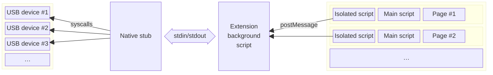

# High-level overview

Data flows through this extension as follows:

Each instance of the web browser (of which most users are usually only running one) hosts a _single_ instance of the extension "[background script](https://developer.mozilla.org/en-US/docs/Mozilla/Add-ons/WebExtensions/Background_scripts)", which talks to _one_ instance of the native stub binary. This communication is done by exchanging JSON messages over [standard streams](https://en.wikipedia.org/wiki/Standard_streams) (stdin/stdout).

The (single) native stub can communicate with any number of USB devices, and it does this using APIs specific to each operating system.

Each web page that the user visits gets two "[content scripts](https://developer.mozilla.org/en-US/docs/Mozilla/Add-ons/WebExtensions/Content_scripts)" injected into it. These scripts can interact with and modify the web page. In this case, "modify" means "makes WebUSB APIs exist".

One of these content scripts runs in the "`ISOLATED`" world while the other runs in the "`MAIN`" world. The "`MAIN`" world script is responsible for creating all of the [types](https://wicg.github.io/webusb/#usbdevice-interface) etc. accessible to the web page. The "`MAIN`" world script sends data back and forth to the "`ISOLATED`" world script using function calls. The "`ISOLATED`" world script packages this up into [messages](https://developer.mozilla.org/en-US/docs/Web/API/Window/postMessage) to communicate with the background script.

The main factor driving this design was the desire to be able to provide notifications according to [WebUSB descriptors](https://wicg.github.io/webusb/#webusb-descriptors). This is used by hardware devices to suggest a web page that a user can visit in order to interact with the device. In order to make this work, something needs to be watching for USB devices even when no web page is trying to use USB. Once there existed _a_ background service, it felt easiest to route _all_ requests through that single service.

This was reinforced by the fact that each extension can only have a single background page. (Firefox doesn't support background service workers. Multiple script _files_ are possible, but they run in the same background context.) It didn't feel very useful to "fan out" requests to multiple processes when requests always get serialized while passing through the background page.

## Where state is kept

This extension is architected around WebExtensions Manifest V2 with a persistent background script. This means that both the background script and the native stub are "long-lived" and are expected to stick around the entire time the browser is open.

As a result, I have chosen that:

- the native stub keeps around (in its memory) information about all USB devices on the system. This information includes things such as the vendor/product IDs and handles for accessing the device via the operating system.
- the background script also keeps around information about all USB devices on the system. It also keeps all the information about user consent and permissions granted to each page.
- the "isolated" content script keeps almost no information. It is mostly responsible for exchanging messages with the "main" content script.
- the "main" content script keeps information only about devices that the page has specifically been granted access to.

Some consequences of these architectural choices:

- the native stub does not know anything about web pages at all. Although it happens to implement the VID/PID blocklist, it is primarily focused on dealing with operating system APIs. It does not handle any WebUSB-specific security concerns. This is okay because it isn't able to do anything beyond what "any other random program" on the computer could also do.
- the extension background script is important for security. It is responsible for making sure web pages cannot access anything the user has not granted permissions for.
- because there is _one_ extension background script and _one_ native stub serving _multiple_ pages, the background script also needs to track the number of pages that have opened the same device and which (if any) pages have "claimed" an interface for exclusive access. This sharing/multiplexing/reference-counting would normally be handled by the operating system's USB stack, but we need to duplicate bits of the functionality.
- redundant information is stored in multiple places. Because so many of the relevant APIs are built around message passing (and not state sharing), there exists a high probability that state can get out of sync due to programming mistakes. There is currently no architectural mitigations for this other than "being careful" (which is not really a mitigation).

# Design of the native stub

The native stub is written in Rust. However, due to the heavy reliance on operating-system APIs, the code makes extensive use of `unsafe` throughout. Although some effort has been made to "be very careful" and not have UB or other errors, the code has prioritized using Rust's library ecosystem, build tooling, and the "even unsafe Rust can make a better C" philosophy rather than prioritizing a "Rust-native" design or correctness in all cases.

This code is very "opinionated" and has intentionally avoided using FFI interfaces to existing C code as well as the currently-existing Rust USB libraries, due to prioritizing the following goals:

- async throughout, but _not Rust async_
- having explicit manual control over "event loop" handling
- single-threaded as much as possible (not possible on Windows)
- no messing about with C toolchains while building

During the early brainstorming phase, this project was initially planned to make use of Rust async. Unfortunately, I found that I wasn't able to easily figure out how to integrate "weird" functionality such as udev events or IOKit notification ports into the popular Rust async runtimes. This then led me down a path to studying in detail how Rust async executors are implemented, which then led to a realization that Rust's support for _multithreaded_ async [significantly increases complexity](https://maciej.codes/2022-06-09-local-async.html). I then went down a path of looking into "fine, I'll do it myself".

While investigating how to do it all myself, I was also studying OS APIs for USB, and I realized that _completion events_ map _very_ directly to a message-passing interface (such as the stdio-based one we are required to use). It thus made sense to build around a design where the stub does not keep track of in-flight transfers (only the operating system kernel and the JavaScript code do). The stub turns request messages into syscalls and completion notifications into response messages, completely handing off ownership of all the relevant data to the OS while the transfer is in progress.

This design means that there was _no reason_ to use async in the Rust code. The _other end_ of the connection, JavaScript, is _also_ capable of async, and its async is arguably much more ergonomic to use.

All of this prerequisite studying (at this point primarily focused on macOS and Linux APIs) gave me enough understanding of how completions work on these platforms that I decided I might as well control the program's entire run loop, and I might as well explicitly not use threading. This was inspired by traditional \*nix-and-C style daemon designs.

So, in practice:

## Common features

Global state is packed into the `USBStubEngine` struct. Because other objects (namely `USBDevice` structs) need to refer back to global state, the `USBStubEngine` must be pinned in memory. (The global state owns `USBDevice` structs, which then use raw pointers to refer back to the global state, "C-style".)

Each instance of a device being detected is assigned a "session ID" to identify it. This is most directly inspired by IOKit's design (which actually has such a feature built-in). Other platforms implement an equivalent by incrementing a 64-bit counter. Unplugging a device and then immediately plugging it back in (to the same port) will result in a _different_ session ID.

In-flight USB transfers are stored in a struct which varies depending on OS. This struct owns _all_ of the data needed to deal with the transfer, including a "transaction ID" so that the JavaScript code can match up responses to their corresponding requests.

In-flight transfer structs "really should not" refer back to either the device or global state. This is to try and avoid complex race conditions during device teardown. However, in practice, this rule is followed differently on each platform.

In-flight transfer structs also own all of the memory buffers that the OS might be accessing during a transfer. This includes the actual data itself, metadata about isochronous transfers, as well as any platform-specific structs (e.g. Linux URBs, Windows `OVERLAPPED` structs). Ownership of this is conceptually transferred to the OS during a transfer, and ownership is recovered when the OS tells us that a transfer is complete. If something goes wrong, the code [prefers to let memory get leaked](https://faultlore.com/blah/everyone-poops/), rather than recovering a dangling pointer.

## macOS

macOS uses the `kqueue` syscall in the runloop to wait for events. `stdin` is added to the kqueue in order to handle requests from the browser. Every other notification which comes from IOKit is in fact delivered over a [Mach port](https://docs.darlinghq.org/internals/macos-specifics/mach-ports.html), which can also be added to the kqueue.

This functionality _is_ documented, just not well. The USB interfaces in `IOUSBLib` in particular explicitly support doing this. The key function which bridges the "Mach world" and the "IOKit world" is `IODispatchCalloutFromMessage`.

macOS uses both device handles and interface handles, but macOS, usefully, allows opening a handle to interfaces without claiming them (including to interfaces that we _can't_ claim because a kernel driver is bound). The native stub therefore eagerly tries to open a handle to every single interface as soon as possible. (Other Chromium-derivatives with WebUSB capabilities appear to keep open the device but not individual interfaces, according to IORegistryExplorer.)

When switching configurations, all interfaces are closed and reopened.

macOS does not use endpoint addresses but "pipeRef" indices, and macOS doesn't seem to guarantee that these match up with "the order endpoints are declared in the descriptor". Because of this, a bunch of shuffling is needed to maintain a map of endpoint addresses to pipeRefs.

macOS violates the "really should not" advice about transfers referring back to other data. On this OS, transfers contain a `Rc<RefCell<_>>` pointing back at the struct which owns the raw OS handle to an interface. This is not actually used to _access_ anything but is instead used to prevent the following race condition:

1. A transfer is pending (e.g. an IN transfer on an endpoint which has no data).
2. The device is unplugged (or a similar global state change occurs).
3. For whatever reasons, the device unplug is detected first, before we get notified about the pending transfers (which are no longer possible to complete).
4. The code drops the `USBDevice`, which drops all interface handles, which then asks the OS to close all the handles at the OS level.
5. Closing the OS interface handle deallocates the Mach port that it uses to send us notifications about pending transfers.
6. It is no longer possible to receive information about pending transfers, because we closed the only mechanism we have to get notified.
7. Memory is leaked.

This workaround changes step 4 above so that the OS interface handles will not get closed yet, until the OS returns (failure) information about all pending transfers. It is still the case that pending transfers cannot refer to any _other_ data; it just keeps the OS handle open.

## Linux

Linux uses the `epoll` family of syscalls to wait for events. `stdin` is added in order to handle requests from the browser. udev device notifications are delivered over a [netlink socket](https://man7.org/linux/man-pages/man7/netlink.7.html), which, because it is a socket, can obviously be added to epoll as well.

Although the [official documentation](https://docs.kernel.org/driver-api/usb/usb.html#asynchronous-i-o-support) for Linux only mentions getting completion notifications using [signals](https://man7.org/linux/man-pages/man7/signal.7.html), it is and has always been [in fact possible to use `poll`/`epoll`](https://github.com/torvalds/linux/blob/bf4afc53b77aeaa48b5409da5c8da6bb4eff7f43/drivers/usb/core/devio.c#L2839-L2844). Note that the semantics are a bit fuzzy, since completions are indicated with `EPOLLOUT` even though `write` is never used.

The design of the `epoll` interface results in some annoying implicit data dependencies. Specifically, for each event, epoll only returns a _single_ pointer-sized value. It does _not_ automatically come with the fd that triggered the event. (One possible way that this was intended to be used is to put the fd into this pointer-sized value.) We definitely need the fd in order to handle transfer completions (because we need to issue additional `ioctl` syscalls on the fd), but we also need the session ID in order to handle unplug events. We cannot put both of these pieces of information into the epoll context.

The current design puts the session ID into the epoll context. The run loop then goes through the data structures (in the `USBStubEngine`) to look up the fd. This was chosen in contrast to designs which store a pointer-to-a-struct in the epoll context because it avoids having to consider how to deal with the lifetime of such a struct (especially when it would be safe to deallocate it). A consequence of this design is that not leaking memory during device teardown requires kernel support (the commit `5cce438` mentioned in the README).

The Linux code reads metadata such as cached descriptors from sysfs in order to try to minimize unnecessary bus traffic. sysfs does not seem to be guaranteed to be race-free, but we try and minimize race conditions by opening an fd for the sysfs _directory_.

Linux is the most direct match to WebUSB's programming model, in that it only requires opening one handle to the device. All interfaces are routed through this single handle.

WebUSB does not support transfer timeouts, but we do want timeouts for "internal-use-only" transfers, such as those used to fetch WebUSB descriptors. Unlike other platforms, Linux requires timeouts to be implemented manually when using the asynchronous USB interface. Since this is not generally-available functionality, this is special-cased and implemented using [`timerfd`](https://man7.org/linux/man-pages/man2/timerfd_create.2.html).

## Windows

### Threading

Windows is the anomaly in that it is very eager to spawn threads in ways that you cannot fully control. Windows also does not have a single universal IO multiplexer that works in all cases.

The Windows implementation uses [CM_Register_Notification](https://learn.microsoft.com/en-us/windows/win32/api/cfgmgr32/nf-cfgmgr32-cm_register_notification) (part of the CfgMgr32 APIs) in order to detect device hotplug events. The mechanism this uses under the hood is [undocumented](https://docs.rs/wnf/latest/wnf/), but it invokes callbacks on the [default thread pool](https://learn.microsoft.com/en-us/windows/win32/procthread/thread-pools). Since there is no way to change this, we take advantage of this and perform _blocking_ query operations in the callback to fetch and pre-cache all the USB descriptors we might need. Once we are fully done poking and prodding at the newly-discovered device, we use a [`mpsc::channel`](https://doc.rust-lang.org/beta/std/sync/mpsc/fn.channel.html) to send the _data_ to the main thread. In order to _notify_ the main thread in a multiplex-able way, we use [`SetEvent`](https://learn.microsoft.com/en-us/windows/win32/api/synchapi/nf-synchapi-setevent).

In addition, anonymous pipes (used for the standard streams, at least when talking to the browser) [do not support asynchronous operations](https://learn.microsoft.com/en-us/windows/win32/ipc/anonymous-pipe-operations). Since we are already stuck with threads, we work around this by spawning a thread that performs blocking reads on stdin, writes the data to a `mpsc::channel`, and signals another event.

Finally, for the USB operations themselves, although it is not explicitly called out as possible, WinUSB can be used with [I/O completion ports](https://learn.microsoft.com/en-us/windows/win32/fileio/i-o-completion-ports). The trick is that the underlying `HANDLE` needs to registered in the IOCP, _not_ the `WINUSB_INTERFACE_HANDLE`. (As a side-effect, all associated interfaces will automagically use the same IOCP, even though they use different `WINUSB_INTERFACE_HANDLE`s.) Unfortunately, IOCPs are _not_ wait-able objects!

Here, we are saved by another design choice: all in-flight transfers contain all of the data needed to send completion notifications. They don't require referencing data in the device or engine objects. This means that we can post the completions on a third thread, which exclusively handles IOCP packets and sending results to the web extension. This means that Windows _requires_ the "really should not" advice regarding in-flight transfers.

The net result of all of this is that the main thread only has to handle hotplug and commands, and it multiplexes this using [`WaitForMultipleObjects`](https://learn.microsoft.com/en-us/windows/win32/api/synchapi/nf-synchapi-waitformultipleobjects).

### Devices vs interfaces

In order to make everything even more complicated than has already been described, Windows does _not_ (generally) support opening a handle to "the device" as a whole. It is only possible to open a handle to a _driver_. In the "simplest" case, one driver will be bound to the entire device. However, if the device has multiple interfaces _in a way that is compatible with the "USB generic parent driver (usbccgp.sys)"_, multiple drivers can be bound to different subsets of the interfaces. For example, a device can contain two interfaces, each bound to the WinUSB driver. A device could also contain two interfaces where one is bound to the HID driver and the other to WinUSB. In some cases where this happens, each driver corresponds to _one_ interface. However, this will not be the case if the device makes use of the "Interface Association Descriptors" USB ECN. If IADs are in use, each driver (including WinUSB) can control multiple interfaces (yet still not the entirety of the device).

For even more fun, Windows makes no guarantees that all drivers for a device will be ready at the same time. This code attempts to correctly glue every (WinUSB) interface of a device back together, in spite of this, even when IADs are involved.

Windows also does not allow "claiming" only subsets of the interfaces, and an open of the WinUSB driver automatically claims all interfaces covered by that instance of the driver. Worse yet, the driver can only be accessed by going through the "primary" interface. The code attempts to use reference counting to patch up the semantics of this so that it matches WebUSB as best as it can.

Finally, accessing cached descriptors of a device needs to be done by sending requests to the hub a device is plugged in to (which can be a root hub). This code automatically traverses up the device tree in order to do this.

### Enumeration quirks

The Windows driver model is built around notifying programs about devices that "speak a certain protocol" (have a certain _device interface class_, identified by a GUID). This is designed for an ecosystem where different vendors ship their own unique and incompatible devices (which might all happen to use the WinUSB kernel driver) and want to write their own software which only speaks to their devices. Their software can easily ask Windows to filter for only their GUID.

This model is very much _not_ designed for something like WebUSB or similar software which provides "generic" access to talk to any device (after all, how do you talk to a device whose protocol you don't know?).

WinUSB _does_ have an undocumented generic GUID called `GUID_DEVINTERFACE_WINUSB_WINRT`. As the name implies, it seems to be used by the [WinRT](https://learn.microsoft.com/en-us/uwp/api/windows.devices.usb?view=winrt-28000) generic USB APIs. However, that page implies that WinUSB may apply extra restrictions to access via this GUID, and the restrictions are very similar _but not identical_ to WebUSB's restrictions ("Image" and "Printer" are listed as prohibited, whereas they are not prohibited by WebUSB).

To deal with all of this, this code asks for _all_ USB devices (upon startup) and hotplug notification about _all_ devices. It then manually checks whether or not they are WinUSB devices, looks up the `DeviceInterfaceGUIDs` requested by the device, and checks whether we are dealing with a desired GUID. This incidentally should avoid driver startup race conditions.

## Shortcomings

The biggest flaw with the native stub is the amount of code duplication. This is a consequence of my not having understood the quirks of each platform before starting. As a consequence, a lot of code is not broken up into the most useful of abstraction boundaries.

There are a lot of self-referential raw pointers in use. Hopefully this is all correct, but it has not been thoroughly audited.

# Design of the background script

The background script is (imho) fairly-typical JavaScript code. The feature which I feel most notable to document is the "outstanding transactions router". This is made up of all of the logic surrounding the `usb_txns` global variable.

In order to be able to match up responses (e.g. data from a USB device) with the request that issued it, each request is assigned a "transaction ID". To the Rust code, this is an opaque string. However, the JavaScript code formats and parses it as `x-y`, where `x` and `y` are numbers (e.g. `1-5` or `0-26` or `45-1`).

The first number indicates the page which issued the request. Page 0 is reserved for requests issued from the background script itself (which is used to fetch the WebUSB and additional string descriptors). Every time any other web page is opened, it is assigned a new page ID starting from 1 (hopefully you won't be able to open more than $2^{53}$ pages).

If the request came from a page, the response message winds its way through a series of callbacks (used for updating state when necessary, such as when opening a device or claiming an interface), eventually ending in a `postMessage` call sending the appropriate data to the page.

If the request came from the background script itself, the `usb_txns` variable stores the `resolve` and `reject` functions for the relevant `Promise`. Responses from the native stub will end up calling one or the other, thereby converting the message-passing interface into JavaScript async.

## Auxiliary pages

The extension has a "debug" page which can request dumps of the JavaScript internal state. This uses the "one-off" messaging interface in a request-response manner.

In order to invoke the user permission page, the only mechanism that appeared to be available to send it information was to use query parameters. Each permission prompt is assigned an incrementing numeric ID (to match up approvals/denials with the appropriate page making the request). The permission page is given only the bare "session ID" of USB devices matching the filter, and it likewise uses a request-response message to request further information such as the device strings.

## Shortcomings

The biggest issue with this code is that it has not been refactored or otherwise restructured, and so it primarily consists of several gigantic functions.

# Design of the content scripts

## Isolated script

I am going start by admitting that I don't entirely understand the security model of content scripts, despite reading the explanation of "Xray vision" in the documentation.

There are two content scripts needed for each page, an "isolated" script and a "main" script. The reason that this is required is because I could not figure out how (or if) it was possible to expose complex objects such as classes to the web page from an isolated script. This can be straightforwardly done from a "main" script. However, it isn't possible to use runtime messaging from the "main" script.

However, the documentation _did_ have a clear and obvious example of how to expose `Promise`s from the isolated script to the main script. The isolated script therefore exposes an _async_ function to the main script, and it uses a `Map` (just like the background script) to translate between messages and `Promise`s.

The isolated script also accepts and holds on to a callback from the main script in order to send it events (for device connection/disconnection).

All "magic" interface methods are injected into the global `window` scope but are immediately deleted once the "main" script runs. Hopefully this is safe.

## Main script

This script implements the WebUSB API surface. It mostly consists of large amounts of "glue", especially relating to handling the types for USB descriptors.
