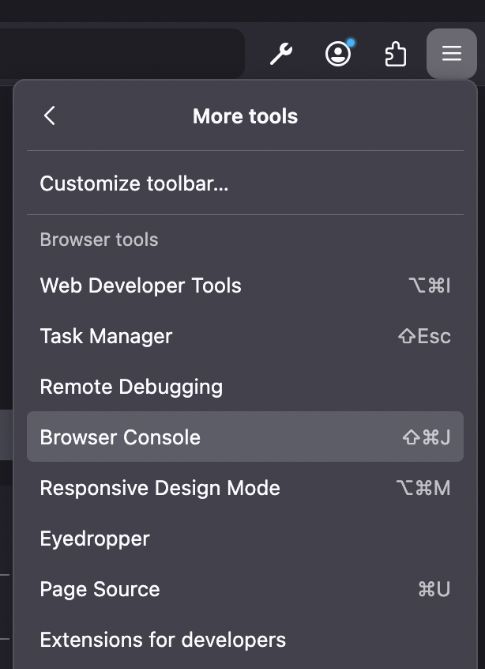
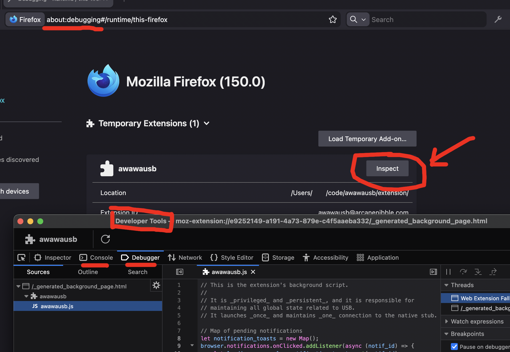
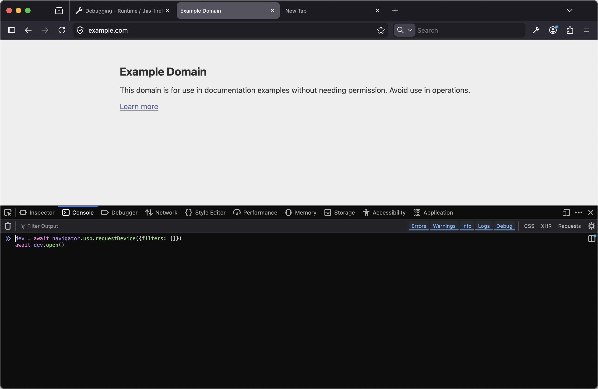

# Developer debugging documentation

## Transient activation

If you are hacking on this code, the first thing that you might want to do is to change `DEBUG_DISABLE_TRANSIENT_ACTIVATION` to `true` in `extension/page.js`. This disables a security check for [transient activation](https://developer.mozilla.org/en-US/docs/Glossary/Transient_activation).

The purpose of this security check is to prevent websites from annoying users by repeatedly popping up (unwanted) permission prompts. A page is only allowed to request permissions in the moments where a user is "meaningfully" interacting with the page (such as by clicking a button).

Unfortunately, "typing ad-hoc test commands into the browser console" does not grant transient activation in Firefox. If your development workflow involves doing this, you will want this check temporarily disabled.

If your workflow entirely consists of testing with "real" web pages, this hack is unnecessary.

## Native stub debug logs

The native stub uses the `log` crate and prints messages to `stderr`. Currently, the log level is not configurable, and all messages will show up.

In the browser, these messages show up in the ["Browser Console" for the "whole browser"](https://firefox-source-docs.mozilla.org/devtools-user/browser_console/index.html). As described in that page, this can be opened via the hamburger menu⇨More tools⇨Browser Console or via the "Tools" system menu⇨Browser Tools⇨Browser Console.

This stderr spam currently logs all transfers including their associated data buffers.

## Background script debug logs

The background script has fewer debug logs, but the ones that it has are logged to a different console. To get to it, click the "Inspect" button on the `about:debugging` page.

This is also the way to single-step debug the background script.

## Manually issuing requests, debugging the page

In order to use the WebUSB API, you need to have a page loaded. This might seem obvious, but, unfortunately, `about:blank` does not count as a page for this purpose.

I have been primarily testing by opening `example.com` and issuing the requests from the browser console:

To single-step through the `page.js` code, it appears under `<anonymous code>` in the debugger tab.
