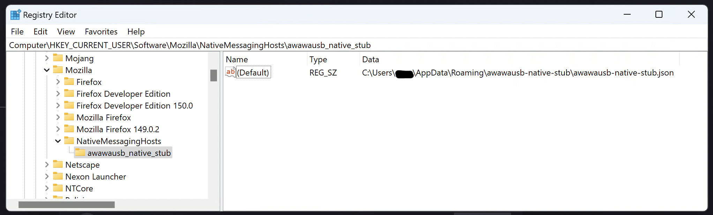
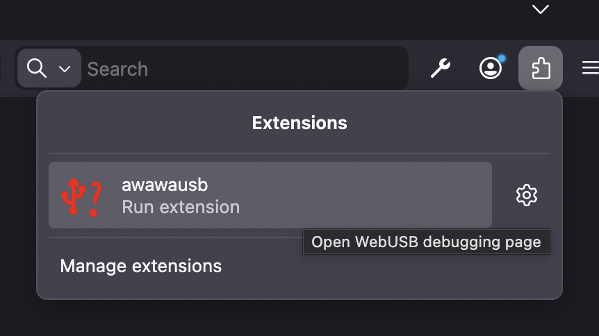
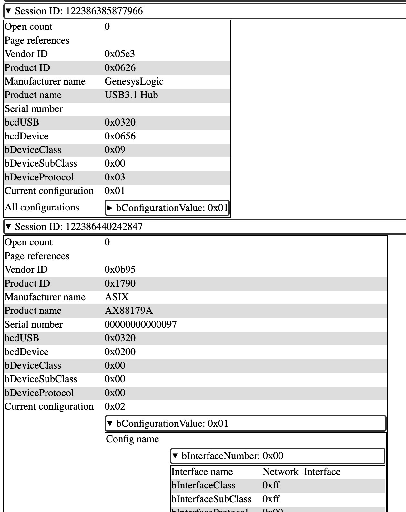

# WebUSB extension for Firefox

This extension adds WebUSB functionality to Firefox by making use of [native messaging](https://developer.mozilla.org/en-US/docs/Mozilla/Add-ons/WebExtensions/Native_messaging).

In order to use this, you need to _both_ install the extension in your browser and install a small program (separate from the browser) on your computer. This extra program is called the "native stub".

## Feature support

This extension is supposed to be compatible with Chrome's implementation. Please report any differences you encounter that result in software not working.

However, unlike Chrome, this API is only exposed on the main page and is not available in [Web Workers](https://developer.mozilla.org/en-US/docs/Web/API/Web_Workers_API/Using_web_workers).

Android cannot be supported, because it does not have native messaging capabilities.

## Installation instructions

You can install this extension by downloading binaries from the GitHub "Releases" section (in the right-hand column), or you can build from source.

### Installing the extension

To install a signed version of the extension, download the .xpi file and open it in Firefox.

To load a _testing_ version of the extension in Firefox Developer Edition, open `about:debugging`, select "This Firefox" in the left-hand list, then "Load Temporary Add-on…", and then browse to the `manifest.json` inside the `extension/` directory.

### Installing the native stub

If you are using prebuilt binaries, unzip _all_ of the files and then run either `./install.sh` (on Linux or macOS) or `install.bat` (on Windows). These installers will try to automatically copy the appropriate files into a sensible location and then configure a [native manifest](https://developer.mozilla.org/en-US/docs/Mozilla/Add-ons/WebExtensions/Native_manifests) so that the browser can find it.

Prebuilt binaries are available for the following platforms:

- macOS x86_64 and ARM64
- Linux x86_64 and aarch64
- Windows AMD64 and ARM64

If you are not using prebuilt binaries, see [below](#compiling-from-source).

### "Unusual" configurations

The default installer is known to have problems with uncommon configurations such as:

- sharing a \*nix home directory across different computers with different CPU architectures
- Windows roaming user profiles across computers with different CPU architectures

The root cause of this is because the "native manifest" mechanism was not designed well to take these situations into account (for example, through its use of absolute paths). If you are in one of these situations, you will unfortunately need to invent an ad-hoc workaround.

## System requirements

This native stub tries to avoid doing anything too "exciting", but, due to development and testing resource constraints, it focuses on "reasonably modern" desktop platforms.

### macOS

macOS 10.15 or later is required, matching Firefox's system requirements. However, older systems are not very well-tested. Expect macOS 12 to be a much more reasonable baseline.

### Windows

Windows 10 or later is required, due to the requirements of the Rust platform support. This also matches Firefox system requirements. Backporting to Windows 8/8.1 might theoretically be possible, but any older is not expected to work (due to limitations in WinUSB).

### Linux

Linux kernel version 4.8 or later is required. (More specifically, a kernel containing commit `5cce438` and `USBDEVFS_CAP_REAP_AFTER_DISCONNECT` is _strongly_ recommended, and a kernel supporting `USBDEVFS_DISCONNECT_CLAIM` is required.)

Your system must have `/dev` and `/sys` mounted.

In order to detect USB devices being connected, a userspace with [udev](https://man7.org/linux/man-pages/man7/udev.7.html) or a compatible daemon is required. Specifically, a daemon which broadcasts `0xfeedcafe`-format messages on `NETLINK_KOBJECT_UEVENT` group `2` is required.

## Compiling from source

In general, this native stub is written entirely in Rust and can be built using `cargo build` in the `native-stub` directory. Cross-compiling _is_ supported and is configured by default for the supported platforms.

If this does not "just work", the following notes might help:

### macOS

This _really_ should just work. The repository contains a vendored copy of all the `.tbd` files needed to link the final binary. If that is somehow causing problems, disable the appropriate entries in `.cargo/config.toml` (which will then require you to have a macOS SDK installed).

### Linux

Linux prebuilt binaries are set up to use [musl libc](https://www.musl-libc.org/) with Rust's default of static linking. The goal of this is to produce binaries which work across any distro. If this is not desired, you may need to change the appropriate `RUSTFLAGS`.

Glibc builds _should_ work but are not tested.

### Windows

Windows prebuilt binaries are set up to build using [mingw-w64](https://www.mingw-w64.org/) targeting the UCRT. This corresponds to the `*-windows-gnullvm` targets in Rust.

Windows is primarily tested using cross-builds from platforms _other than_ Windows. Building on Windows is supposed to work, but may require adding the `rust-mingw` component. See the [rustc documentation](https://doc.rust-lang.org/nightly/rustc/platform-support/windows-gnullvm.html#building-rust-programs) for more details.

If you are building this from a system other than Windows, you will need to obtain mingw-w64 `.lib` files from somewhere (such as by following the steps which happen to be in the [Dockerfile](Dockerfile)). There is a _hardcoded_ path in `.cargo/config.toml` which will need to be examined/changed in order to find these libraries.

Building with the MSVC toolchain is _not_ supported (there is no fundamental reason why it cannot work, it just isn't tested).

### Setting up a native manifest

In order for the browser to find your compiled binaries, you will need to install a "manifest" file in a specific location on your computer. The manifest is a short JSON (JavaScript Object Notation) file which goes into [a specific location](https://developer.mozilla.org/en-US/docs/Mozilla/Add-ons/WebExtensions/Native_manifests#manifest_location) depending on your operating system. To repeat the relevant lines of the documentation:

#### macOS

`/Library/Application Support/Mozilla/NativeMessagingHosts/awawausb_native_stub.json` (global)

`~/Library/Application Support/Mozilla/NativeMessagingHosts/awawausb_native_stub.json` (user-local)

#### Linux

`/usr/lib/mozilla/native-messaging-hosts/awawausb_native_stub.json` (global)

`/usr/lib64/mozilla/native-messaging-hosts/awawausb_native_stub.json` (global)

`~/.mozilla/native-messaging-hosts/awawausb_native_stub.json` (user-local)

#### Windows

The manifest file can be placed anywhere, but a registry key must be set to point to it. The registry keys are:

`HKLM\SOFTWARE\Mozilla\NativeMessagingHosts\awawausb_native_stub` (global)

`HKCU\SOFTWARE\Mozilla\NativeMessagingHosts\awawausb_native_stub` (user-local)

The following screenshot shows a correctly-configured registry entry:



#### Contents of the native manifest

The JSON file should contain the following contents:

```json
{
  "name": "awawausb_native_stub",
  "description": "Allows WebUSB extension to access USB devices",
  "path": "/path/to/awawausb-native-stub",
  "type": "stdio",
  "allowed_extensions": ["awawausb@arcanenibble.com"]
}
```

However, on Windows, a full path is not required (i.e. only `"awawausb-native-stub.exe"` is sufficient).

## Troubleshooting

This extension has an internal debugging page that can be accessed by clicking the button in the browser toolbar (typically found by clicking on the "Extensions" icon):



As an end-user, the most useful feature of the debugging page is the "List devices" button which shows all USB devices that the extension itself knows about (even if there are no pages trying to talk to it):



If a device you want a web page to talk to is _not_ listed here, that means that there is a configuration problem at the "operating system" level. Fixing this will require making changes to your computer outside of the web browser, which may require "administrator" permissions on your computer. (If this is a computer that you personally own, you probably have "administrator" permissions.)

If you are a developer, see [here](Documentation/dev-debugging.md) for an explanation of this extension's internal debugging functionality.

### Windows

On Windows, the only USB devices that this extension can access are those that use the "WinUSB" driver. A "driver" is special software which the computer needs in order to know how it should talk to a device.

When a USB device is being designed, the maker of the device can put information into it to help suggest an appropriate driver. For example, a mouse or keyboard can contain information recommending the use of the standard mouse and keyboard driver, or a webcam can contain information recommending the use of the standard webcam driver. The makers of a very-special-and-unique device might put information which recommends use of a custom driver that they have developed themselves.

"WinUSB" is a driver which can talk to "any" USB device. However, the ability to talk to "any" device comes with engineering tradeoffs. Using WinUSB as the driver prevents the computer _as a whole_ from being able to use _or share_ the USB device's "special" functionality. Instead, only one program at a time gets _exclusive_ access to the device, and this program no longer gets much of the operating system's help. For example, when a USB printer uses a "printer" driver, multiple programs on the computer can print documents to it, and the operating system will automatically put these into a queue so that the documents are printed one after another. If the computer has access to multiple _different_ printers, the operating system helps software easily print to all of them without having to write code for each model individually. If this hypothetical USB printer were instead to use WinUSB as the driver, office and productivity software would no longer be able to share access to it. Instead, only one program at a time could use the device, and this program must contain code to talk to _this specific printer_.

For "simple" devices which do not implement "system-wide" functionality and do not need to be shared, the maker of the device can choose to recommend that Windows use the WinUSB driver. In this case, no end-user configuration should be needed. This is the [recommended practice](https://developer.chrome.com/docs/capabilities/build-for-webusb) for devices designed specifically for WebUSB.

The system administrator can override the choices that Windows makes and/or that the device maker suggests, such as by forcing the use of the WinUSB driver even when other choices exist. One possible reason to do this might be if the recommended driver is no longer compatible with the operating system (for example, for an obsolete peripheral). Another reason to do this might be if the recommended drivers are unreliable or otherwise do not work as desired. "Not working as desired" includes the use-case of "wanting to use third-party software, such as WebUSB, to control the device."

A tool called [Zadig](https://zadig.akeo.ie/) can be used to easily reconfigure the driver used by a device. You can use this tool to select the WinUSB driver in order to make a device compatible with WebUSB. You should only do this if you understand the implications of doing so, as explained above.

### Linux

Most installations of Linux by default do not allow access to USB devices by "unprivileged" users. This practice has its origins in the use of "unix-like" operating systems on computers which were [used remotely by many people at the same time](https://en.wikipedia.org/wiki/Time-sharing). These cultural defaults tend to persist even when Linux is being installed on a _personal_ computer primarily being used locally by a single person. (There are exceptions: for example, the Steam Deck has been specifically designed for a "personal computer" experience and enables "unprivileged" access to all USB devices by default.)

Regardless of the defaults, permission to access a USB device is ultimately controlled by filesystem permissions on the device nodes inside `/dev/bus/usb`. The `ls -l` command can be used to view "normal" permissions, and the `getfacl` command can be used to view additional "POSIX ACL" permissions. Unfortunately, I am not aware of a good introduction to the idea of unix-style permissions, but [OpenBSD's manual on the `chmod` command](https://man.openbsd.org/chmod.1) is a useful place to start.

Unfortunately, actually _changing_ the permissions is more complicated, especially because these device nodes are deleted and _re_-created (resetting their permissions) as USB devices get unplugged/plugged from the computer. On "most" current Linux "desktop" installations, permissions for USB devices is controlled via a service called [udev](https://www.freedesktop.org/software/systemd/man/latest/udev.html).

Because Linux installations are highly customizable, there is no one single set of instructions that works in all cases. However, the most common practices are generally one of the following:

1. Writing a udev rule to set the unix permissions of a device to `0666`. This corresponds to giving "read and write" access to the device to "all users" on the computer.
2. Writing a udev rule to to set the unix permissions to `0660`, changing the "group" of the device to a particular name (e.g. `plugdev`), and then adding "users who should be able to use USB devices" to that group.
3. Adding the `uaccess` "tag" attribute to udev's internal model of devices and then relying on [systemd](https://systemd.io/) to dynamically change permissions based on its model of who is "physically logged in" to the computer.

Despite its complexity, option 3 is the current recommended best practice.

The differences between these options are most relevant for certain specific use cases, such as remotely logging in to a computer (meaning that you are not physically sitting in front of the computer and able to touch the hardware connected to it) or "fast user switching" between different users on the same computer. In the common use case in the modern day of a portable, personal computer that gets shared by "physically handing it to somebody irl," these technical controls serve very little practical purpose.

In order to configure option 3 on a typical installation, create a file `/etc/udev/rules.d/50-my-usb-device.rules` and insert something like the following into it:

```text
ACTION!="remove", SUBSYSTEMS=="usb", ATTRS{idVendor}=="1234", TAG+="uaccess"
```

In order to configure options 1 and 2, use `MODE=` and `GROUP=` commands (in a udev rule, placed in the same location).

## Developer documentation

See [Documentation/architecture.md](Documentation/architecture.md) to get started.
